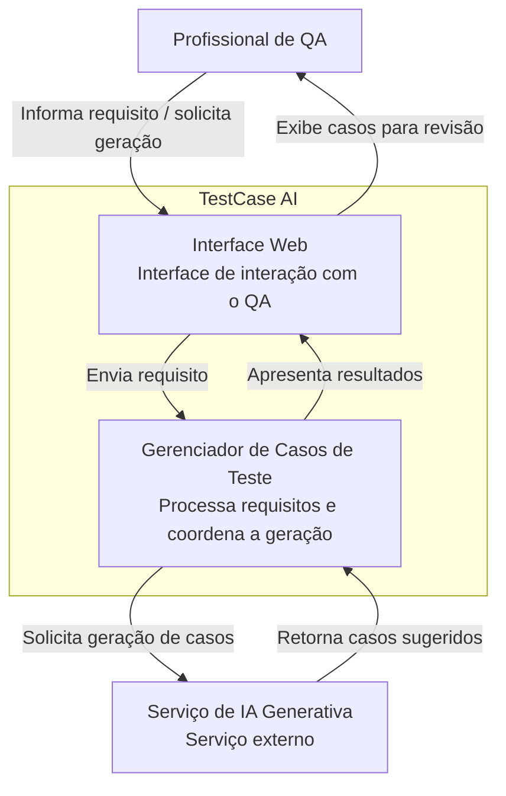

TestCase AI — Sistema de Geração de Casos de Teste com IA Generativa
1. Visão geral
O TestCase AI é uma proposta de sistema de apoio a profissionais de Quality Assurance (QA) na elaboração de casos de teste a partir de requisitos de software escritos em linguagem natural.
O sistema utiliza Inteligência Artificial Generativa para sugerir casos de teste estruturados a partir de um requisito informado pelo usuário.
A proposta deste projeto é realizar uma pequena etapa de discovery e documentação arquitetural, utilizando a abordagem Diagrams as Code para representar a arquitetura do sistema por meio de diagramas escritos em Mermaid.
Importante: nesta etapa, o projeto tem como foco a documentação e a definição arquitetural do sistema. A implementação da aplicação não faz parte do escopo da atividade.
2. Objetivo
O objetivo do TestCase AI é auxiliar profissionais de QA na identificação e elaboração de casos de teste a partir de requisitos de software.
A ferramenta deverá receber um requisito em linguagem natural e utilizar IA Generativa para sugerir cenários de teste, incluindo situações positivas e negativas.
Os casos gerados devem ser considerados sugestões e precisam ser revisados e validados pelo profissional de QA.
3. Escopo
3.1 Dentro do escopo
O sistema deverá:
receber um requisito de software em linguagem natural;
permitir que o usuário solicite a geração de casos de teste;
utilizar IA Generativa para analisar o requisito;
sugerir casos de teste positivos e negativos;
apresentar os casos de teste de forma estruturada;
permitir a revisão dos casos gerados pelo profissional de QA.
3.2 Fora do escopo
Não fazem parte desta proposta:
execução automática dos testes;
criação automática de scripts Selenium;
execução de testes de API;
criação automática de bugs;
integração com Jira;
gerenciamento de usuários;
autenticação;
armazenamento permanente dos casos de teste;
aprovação automática dos casos pela IA.
4. Atores
4.1 Profissional de QA
É o usuário principal do sistema.
Suas responsabilidades são:
informar o requisito de software;
solicitar a geração dos casos de teste;
analisar os casos sugeridos;
corrigir ou complementar os casos quando necessário;
decidir se os casos gerados são adequados para utilização.
4.2 Serviço de IA Generativa
É um serviço externo utilizado pelo sistema para analisar o requisito e gerar sugestões de casos de teste.
A IA não possui responsabilidade pela aprovação final dos casos.
5. Responsabilidades dos componentes
Interface Web
Responsável pela interação entre o profissional de QA e o sistema.
Gerenciador de Casos de Teste
Responsável por:
receber o requisito;
validar a entrada;
preparar a solicitação para a IA;
enviar a solicitação ao serviço de IA Generativa;
receber a resposta;
organizar os casos de teste para apresentação ao usuário.
Serviço de IA Generativa
Responsável por:
interpretar o requisito recebido;
identificar possíveis cenários;
sugerir casos de teste;
estruturar as informações solicitadas pelo sistema.
Profissional de QA
Responsável pela revisão e validação dos casos gerados.
6. Integrações
O sistema deverá possuir integração com um serviço externo de Inteligência Artificial Generativa por meio de uma API.
O provedor e o modelo de IA a serem utilizados ainda não foram definidos nesta etapa do discovery.
7. Restrições
O sistema deverá considerar as seguintes restrições:
os casos gerados pela IA não devem ser considerados automaticamente corretos;
a validação final deverá permanecer sob responsabilidade do profissional de QA;
requisitos contendo informações sensíveis não deverão ser enviados a serviços externos sem uma política adequada de segurança e privacidade;
a geração dos casos depende da disponibilidade do serviço externo de IA;
o sistema não deverá armazenar senhas, tokens ou credenciais como parte do processamento dos requisitos.
8. Lacunas identificadas
Durante o discovery inicial, algumas decisões ainda não foram definidas:
qual provedor de IA será utilizado;
qual modelo de IA será utilizado;
qual será o formato definitivo da requisição enviada à IA;
qual será o formato definitivo da resposta;
quantidade máxima de casos gerados por solicitação;
tamanho máximo do requisito enviado;
critérios utilizados para avaliar a qualidade dos casos gerados;
estratégia de tratamento de falhas do serviço de IA;
necessidade de armazenamento dos casos de teste;
necessidade de autenticação e controle de acesso.
Essas lacunas deverão ser resolvidas antes de uma eventual implementação do sistema.
9. Arquitetura
A arquitetura será documentada utilizando a abordagem Diagrams as Code, com diagramas escritos em Mermaid.
9.1 Diagrama estrutural
O diagrama abaixo apresenta uma visão estrutural do TestCase AI, inspirada no modelo C4, destacando os principais containers do sistema e sua integração com o serviço externo de IA Generativa.

9.2 Diagrama comportamental
A jornada crítica escolhida para representação comportamental será:
Geração de casos de teste a partir de um requisito de software.
O diagrama de sequência será incluído nesta seção após a etapa de geração e revisão com auxílio de IA Generativa.
10. Uso de IA Generativa
A IA Generativa será utilizada como ferramenta de apoio à documentação arquitetural.
Inicialmente, será utilizada para gerar propostas de diagramas em Mermaid a partir da descrição do sistema.
Os resultados gerados serão analisados criticamente e poderão ser modificados para garantir aderência ao escopo, às responsabilidades e às restrições definidas neste documento.
A IA será considerada uma ferramenta de apoio e não como autoridade sobre as decisões arquiteturais do sistema.
11. Decisões e ajustes realizados
Esta seção registrará as decisões tomadas durante a análise dos resultados produzidos pela IA Generativa.
Serão documentados:
componentes adicionados ou removidos;
responsabilidades corrigidas;
integrações inferidas indevidamente;
alterações realizadas nos diagramas;
decisões arquiteturais tomadas durante a revisão.
12. O que a IA inferiu corretamente
Nesta seção serão registrados os elementos identificados corretamente pela IA Generativa durante a elaboração dos diagramas.
13. O que precisou ser ajustado
Nesta seção serão registrados os elementos que foram incorretamente inferidos ou representados pela IA e que precisaram ser corrigidos.
14. O que ainda seria necessário para um agente implementar o sistema
Para que um agente de desenvolvimento consiga implementar o sistema sem precisar inventar decisões, seria necessário complementar a documentação com informações como:
requisitos funcionais detalhados;
requisitos não funcionais;
regras de negócio;
critérios de aceite;
contrato da API de IA;
definição do modelo de IA;
estrutura dos prompts;
formato das entradas e saídas;
tratamento de erros;
requisitos de segurança;
critérios de testes;
regras para avaliação dos casos de teste gerados.
15. Conclusão
O TestCase AI demonstra como a utilização de Inteligência Artificial Generativa pode ser combinada com a abordagem Diagrams as Code para apoiar a documentação e o discovery de um sistema de software.
A documentação busca manter explícitos o escopo, as responsabilidades, as restrições e as lacunas do sistema, permitindo que os diagramas sejam revisados e versionados junto com a documentação.
A análise crítica dos resultados gerados pela IA é parte fundamental do processo, uma vez que o modelo pode inferir componentes ou decisões que não foram estabelecidos durante o discovery.
